# 教程：Gen 中的建模简介

Gen 是概率建模和推理的多范式平台。Gen 支持多种建模和推理工作流程，包括：

- 使用蒙特卡罗，变分，EM 和随机梯度技术在生成模型中进行无监督学习和后验推理。

- 有条件推理模型的监督学习（例如监督分类和回归）。

- 混合方法，包括摊销推理/推理编译，变分自动编码器和半监督学习。

在 Gen 中，概率模型（生成模型和条件推理模型）表示为*generative functions*。Gen 提供了一种用于定义生成函数的内置建模语言（Gen 也可以扩展为支持其他建模语言，但本教程不包含此内容）。本教程介绍了 Gen 的内置建模语言的基础知识，并说明了该语言提供的几种建模灵活性，包括：

- 使用随机分支和函数抽象来表示多个模型时，哪个模型更适合的不确定性。

- 用无限数量的参数表示模型（'贝叶斯非参数'模型）。

该 Notebook 使用简单的通用推理算法进行后验推理，并显示了一些应用于简单模型的推理示例。Notebook 还介绍了一种通过从推断参数预测新数据并将此数据与观察数据集进行比较来验证模型和推理算法的技术。

本教程不涉及*自定义推理编程*，这是 Gen 的一项关键功能，用户可以实现专门针对其概率模型的推理算法。推理编程对于有效地获得准确的后验推理很重要，将在后面的教程中介绍。此外，本教程并未详尽地介绍建模语言的所有功能 - 还有一些功能和扩展可提供此处未涉及的改进性能。

## 大纲

**第 1 节** [Julia，Gen 和这个 JupyterNotebook](#julia-gen-jupyter)

**第 2 节** [将概率模型写成生成函数](#writing-model)

**第 3 节** [进行后验推理](#doing-inference)

**第 4 节** [预测新数据](#predicting-data)

**第 5 节** [调用其他生成函数](#calling-functions)

**第 6 节** [使用无限数量的参数进行建模](#infinite-space)

## 1. Julia，Gen 和这个 JupyterNotebook<a name="julia-gen-jupyter"></a>

Gen 是 Julia 语言的一个包。该软件包可以这样加载：

```julia
using Gen
```

Gen 程序通常包括 (i) 用建模语言编写的概率模型和 (ii) 用常规 Julia 代码编写的推理程序的组合。Gen 提供了一种基于 Julia 的内置建模语言。

本教程使用 Jupyter notebook。Notebook 中的所有单元格都是普通的 Julia 单元格。在 Julia 中，结尾处的分号是可选的；我们将在某些单元格的末尾使用它们，以便不打印单元格的值。

```julia
a = 1 + 1
```

    2

```julia
a = 1 + 1;
```

这个 Notebook 使用 [PyPlot](https://github.com/JuliaPy/PyPlot.jl)Julia 包进行绘图。PyPlot 包封装了 matplotlib Python 包。

```julia
using PyPlot
```

这个 Notebook 将使用 Julia 符号。注意，Julia 符号与 Julia 字符串是不同的：

```julia
typeof(:foo)
```

    Symbol

```julia
typeof("foo")
```

    String

## 2. 将概率模型编写为生成函数 <a name="writing-model"></a>

概率模型在 Gen 中表示为*生成函数*。
构建生成函数的最简单方法是使用[内置建模 DSL](https://probcomp.github.io/Gen/dev/ref/modeling/).。在内置建模 DSL 中编写的生成函数基于 Julia 函数定义语法，但以 `@gen` 关键字为前缀。该函数表示我们正在建模的数据生成过程：它所做的每个随机选择都可以被认为是模型中的随机变量。
下面的生成函数表示 x-y 平面中符合线性关系的概率模型。给定一组 $x$ 坐标，它随机选择平面中的一条直线并生成相应的 $y$ 坐标，使得每个 $(x, y)$ 都在该直线附近。我们可以认为这个函数是将房价建模成平方英尺的函数，或者测得的气体体积与其量得温度的函数关系。

```julia
@gen function line_model(xs::Vector{Float64})
    n = length(xs)

    # 首先对斜率和截距进行采样。
    # 在得到数据之前，我们不知道这些参数的值，
    # 所以我们随机选择值给它们。
    # 它们的分布源于我们对参数的先前信念（belief）；
    # 这样，斜率和截距就会是一组非零点。

    slope = @trace(normal(0, 1), :slope)
    intercept = @trace(normal(0, 2), :intercept)

    # 给定斜率和截距，我们可以对于输入向量中的每个x坐标，
    # 对y坐标进行采样。
    for (i, x) in enumerate(xs)
        @trace(normal(slope * x + intercept, 0.1), (:y, i))
    end

    # 模型的返回值通常不是特别重要，
    # 这里，我们只返回n，即点的个数。
    return n
end;
```

生成函数将 x 坐标的向量作为参数。下面我们创建一个：

```julia
xs = [-5., -4., -3., -.2, -1., 0., 1., 2., 3., 4., 5.];
```

给定此向量，生成函数取样一个随机选择，该随机选择表示符合 0 均值、标准差为 1 的正态分布的直线的斜率，和一个表示符合均值为 0、标准差为 2 的正态分布的直线的截距的随机选择 。在贝叶斯统计术语中，这些分布分别是斜率和截距的 _先验分布_ 。然后，该函数对与每个提供的 x 坐标取样对应的 y 坐标。

该生成函数返回数据点的数量。我们可以像运行常规 Julia 函数一样运行它：

```julia
n = line_model(xs)
println(n)
```

    11

比`n`更令人关心的是`line_model`所做的随机选择的值。**至关重要的是，每个随机选择都使用唯一的*地址*进行标注。**一个随机选择被 `@trace` 关键字分配地址。地址可以是任何 Julia 值。在这个程序中，有两种类型的地址——Julia 符号，和符号与整数组成的元组。注意，在`for`循环中，同一行代码被执行多次，但每次，它所做的随机选择都被赋予不同的地址。

虽然随机选择不包括在返回值中，但它们 *包含*在生成函数的*执行 trace（trace）*中。我们可以运行生成函数并获得它的 trace，使用 Gen API 中的
[`simulate`](https://probcomp.github.io/Gen/dev/ref/gfi/#Gen.simulate)方法：

```julia
trace = Gen.simulate(line_model, (xs,));
```

此方法接受函数执行，以及函数参数的元组，并返回我们在本教程中不会使用的 trace 和第二个值。当我们打印 trace 时，我们发现它是一个复杂的数据结构。

```julia
println(trace)
```

    Gen.DynamicDSLTrace{DynamicDSLFunction{Any}}(DynamicDSLFunction{Any}(Dict{Symbol,Any}(), Dict{Symbol,Any}(), Type[Array{Float64,1}], ##line_model#360, Bool[false], false), Trie{Any,Gen.ChoiceOrCallRecord}(Dict{Any,Gen.ChoiceOrCallRecord}((:y, 7)=>ChoiceOrCallRecord{Float64}(1.27898, 0.531045, NaN, true),(:y, 9)=>ChoiceOrCallRecord{Float64}(1.18495, 0.383827, NaN, true),(:y, 1)=>ChoiceOrCallRecord{Float64}(2.59637, 0.989953, NaN, true),(:y, 10)=>ChoiceOrCallRecord{Float64}(0.923242, 1.18703, NaN, true),(:y, 5)=>ChoiceOrCallRecord{Float64}(1.83234, 1.2226, NaN, true),(:y, 4)=>ChoiceOrCallRecord{Float64}(1.68603, 1.22205, NaN, true),:intercept=>ChoiceOrCallRecord{Float64}(1.59258, -1.92912, NaN, true),(:y, 3)=>ChoiceOrCallRecord{Float64}(2.29103, 0.267383, NaN, true),(:y, 6)=>ChoiceOrCallRecord{Float64}(1.78879, -0.541288, NaN, true),(:y, 8)=>ChoiceOrCallRecord{Float64}(1.08288, 0.351557, NaN, true),(:y, 11)=>ChoiceOrCallRecord{Float64}(0.681258, 1.38295, NaN, true),(:y, 2)=>ChoiceOrCallRecord{Float64}(2.35704, 1.3311, NaN, true),:slope=>ChoiceOrCallRecord{Float64}(-0.183012, -0.935685, NaN, true)), Dict{Any,Trie{Any,Gen.ChoiceOrCallRecord}}()), false, 5.463390098859433, 0.0, ([-5.0, -4.0, -3.0, -0.2, -1.0, 0.0, 1.0, 2.0, 3.0, 4.0, 5.0],), 11)

生成函数的 trace 包含关于函数执行的各种信息。例如，它包含运行函数的参数，这些参数可以通过 API 方法`get_args`获取：

```julia
Gen.get_args(trace)
```

    ([-5.0, -4.0, -3.0, -0.2, -1.0, 0.0, 1.0, 2.0, 3.0, 4.0, 5.0],)

trace 还包含随机选择的值，存储在从地址到值的映射中，该映射称为*选择映射*。这个映射可以通过 API 方法[`get_choices`]()获得：

```julia
println(Gen.get_choices(trace))
```

    │
    ├── (:y, 7) : 1.2789843754761785
    │
    ├── (:y, 9) : 1.1849531901901305
    │
    ├── (:y, 1) : 2.5963722983723976
    │
    ├── (:y, 10) : 0.9232419919072302
    │
    ├── (:y, 5) : 1.8323447123380334
    │
    ├── (:y, 4) : 1.6860320485983082
    │
    ├── :intercept : 1.5925794282610763
    │
    ├── (:y, 3) : 2.291030703942859
    │
    ├── (:y, 6) : 1.788790237655204
    │
    ├── (:y, 8) : 1.0828836930416266
    │
    ├── (:y, 11) : 0.6812575540332843
    │
    ├── (:y, 2) : 2.3570433271057403
    │
    └── :slope : -0.18301160776308753

我们可以使用 Julia 的下标语法`[...]`从该映射中提取单个值`：

```julia
choices = Gen.get_choices(trace)
println(choices[:slope])
```

    -0.18301160776308753

我们还可以直接从 trace 中读取随机选择的值，而不必首先使用`get_choices`：

```julia
println(trace[:slope])
```

    -0.18301160776308753

返回值也记录在 trace 中，可以使用`get_retval` API 方法访问：

```julia
println(Gen.get_retval(trace));
```

    11

为了理解生成函数的概率学行为，将它的 trace 可视化是很有用的。下面，我们定义一个函数，它使用 PyPlot 渲染上面生成函数的 trace。渲染结果显示了 x-y 数据点，和由斜率与截距表示的直线。

```julia
function render_trace(trace; show_data=true)

    # 从trace中获得x数据xs
    xs = get_args(trace)[1]

    xmin = minimum(xs)
    xmax = maximum(xs)
    if show_data
        ys = [trace[(:y, i)] for i=1:length(xs)]

        # 绘制数据集
        scatter(xs, ys, c="black")
    end

    # 从trace中获得斜率和截距
    slope = trace[:slope]
    intercept = trace[:intercept]

    # 画出直线
    plot([xmin, xmax], slope *  [xmin, xmax] .+ intercept, color="black", alpha=0.5)
    ax = gca()
    ax[:set_xlim]((xmin, xmax))
    ax[:set_ylim]((xmin, xmax))
end;
```

```julia
figure(figsize=(3,3))
render_trace(trace);
```

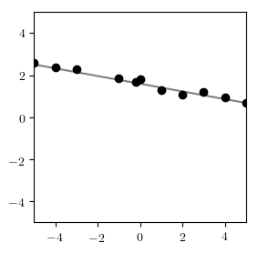

因为生成函数是随机的，我们需要可视化许多运行以了解其行为。下面的单元格呈现一个迹线网格。

```julia
function grid（renderer :: Function，traces; ncols = 6，nrows = 3）
图（figsize =（16,8））
for（i，trace）in enumerate（traces）
subplot（nrows，ncols，i）
渲染器（trace）
end
end;
```

现在，我们生成几条轨迹并在网格中渲染它们

```julia
traces = [Gen.simulate（line_model，（xs，））for = = 1：12]
grid（render_trace，traces）
```

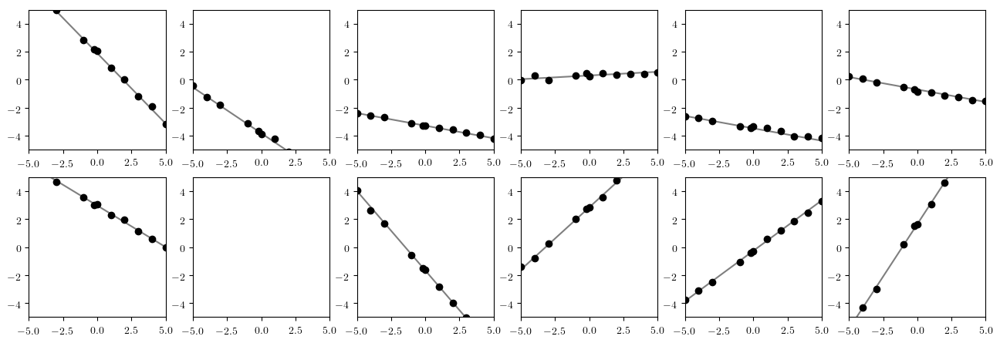

---

### 练习

编写两次使用相同地址的生成函数。运行它看看会发生什么。

---

### 练习

编写一个生成具有随机相位，周期和幅度的正弦波的模型，然后通过将噪声添加到每个 x 坐标处的波的值来从给定的 x 坐标向量生成 y 坐标。
使用一段时间的'gamma（5,1）`先验分布，以及幅度上的'gamma（1,1）`先验分布（参见[`Gen.gamma`]（https://probcomp.github.io） /Gen/dev/ref/distributions/#Gen.gamma））。对该阶段使用均匀分布（参见[`Gen.uniform`]（https://probcomp.github.io/Gen/dev/ref/distributions/#Gen.uniform））。编写一个通过显示数据集和正弦波来渲染轨迹的函数。可视化trace网格并讨论分布。尝试调整每个先前分布的参数，并查看行为如何变化。

###答案

```julia
@gen function sine_model（xs :: Vector {Float64}）
n =长度（xs）
phase = @trace（uniform（0,2 * pi），：phase）
period = @trace（gamma（5,1），：period）
amplitude = @trace（gamma（1,1），：幅度）
for（i，x）in enumerate（xs）
mu =幅度* sin（2 * pi * x /周期+相位）
@trace（正常（mu，0.1），（：y，i））
end
返回
end;
```

```julia
function render_sine_trace（trace; show_data = true）
xs = get_args（trace）[1]
xmin =最小值（xs）
xmax =最大值（xs）
如果是show_data
ys = [trace [（：y，i）] for i = 1：length（xs）]
散射（xs，ys，c =“黑色”）
end

阶段=追踪[：阶段]
period = trace [：period]
幅度=trace[：幅度]

test_points = collect（范围（xmin，stop = xmax，length = 100））
plot（test_points，amplitude * sin。（2 * pi * test_points / period。+ phase））

ax = gca（）
ax [：set_xlim]（（xmin，xmax））
ax [：set_ylim]（（xmin，xmax））
end;
```

```julia
traces = [Gen.simulate(sine_model, (xs,)) for _=1:12];
```

```julia
figure(figsize=(16, 8))
for (i, trace) in enumerate(traces)
    subplot(3, 6, i)
    render_sine_trace(trace)
end
```

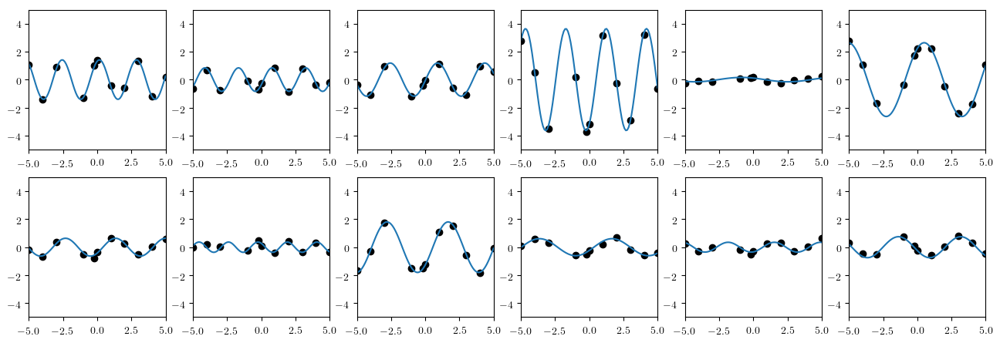

## 3. 进行后验推断<a name="doing-inference"></a>

我们现在将提供 y 坐标的数据集，并尝试绘制有关生成数据的过程的推论。我们从以下数据集开始：

```julia
ys = [6.75003, 6.1568, 4.26414, 1.84894, 3.09686, 1.94026, 1.36411, -0.83959, -0.976, -1.93363, -2.91303];
```

```julia
figure(figsize=(3,3))
scatter(xs, ys, color="black");
```

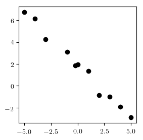

我们假设线模型负责生成数据，并推断解释数据的斜率和截距值。

为此，我们编写了一个简单的*推理程序*，它采用我们假设的模型生成我们的数据，数据集和要执行的计算量，并返回从*posterior 分布中近似采样的函数的轨迹*根据观察到的数据，在功能的痕迹上。也就是说，推理程序将尝试找到一条很好地解释我们上面创建的数据集的 trace。我们可以检查该轨迹以找到适合数据的线的斜率和截距的估计。

像“importance*resampling”这样的函数希望我们提供一个\_model*和一个*choice map*来表示我们的数据集并将它与模型相关联。选择映射将模型中的随机选择地址映射到数据集中的值。在这里，我们想把像（（y，4）`这样的模型地址绑定到像`ys [4]`这样的数据集值：

```julia
function do_inference(model, xs, ys, amount_of_computation)

＃创建一个映射模型地址的选择图（：y，i）
＃到观测值ys [i]。我们离开：斜坡和：拦截
#constrained，因为我们希望它们被推断出来。
观察= Gen.choicemap（）
for（i，y）in enumerate（ys）
观察[（：y，i）] = y
end

＃调用importance_resampling以获得可能的trace一致性
＃与我们的观察。
（trace，_）= Gen.importance_resampling（model，（xs，），observation，amount_of_computation）;
返回痕迹
end;
```

我们可以运行推理程序来获取 trace，然后可视化结果：

```julia
trace = do_inference（line_model，xs，ys，100）
图（figsize =（3,3））
render_trace（痕量）;
```

 for _=1:10];
grid(render_trace, traces)
```

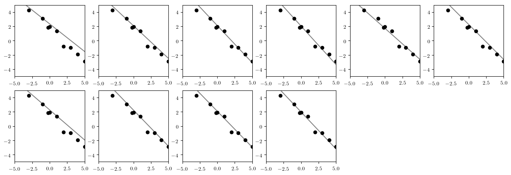

我们在这里可以看到存在一些不确定性：由于我们的数据有限，我们无法 100％确定该线的确切位置。通过在一个图中而不是在网格中可视化所有迹线，我们可以更好地了解后验分布的可变性。每个 trace 将具有相同的观察数据点，因此我们仅根据第一个 trace 中的值绘制一次：

```julia
function overlay(renderer, traces; same_data=true, args...)
渲染器（痕迹[1]，show_data = true，args ...）
对于i = 2：长度（迹线）
渲染器（traces [i]，show_data =！same_data，args ...）
end
end;
```

```julia
traces = [do_inference(line_model, xs, ys, 100) for _=1:10];
图（figsize =（3,3））
overlay（render_trace，traces）;
```

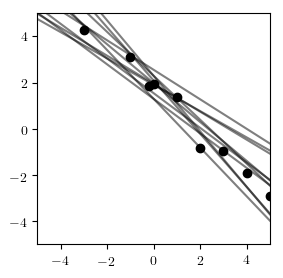

---

### 练习

上面的结果是为'amount_of_computation = 100`获得的。运行该算法，将此值设置为“1”，“10”和“1000”等。哪个值似乎是准确性和运行时间之间的良好折衷？讨论。

---

### 练习

考虑以下数据集：

```julia
ys_sine = [2.89, 2.22, -0.612, -0.522, -2.65, -0.133, 2.70, 2.77, 0.425, -2.11, -2.76];
```

```julia
图（figsize =（3,3））;
scatter（xs，ys_sine，color =“black”）;
```

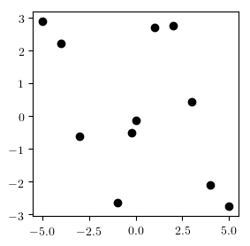

编写一个推理程序，生成解释此数据集的`sine_model`的痕迹。可视化生成的迹线分布。暂时将该期间的先前分布更改为“gamma（1,1）”（通过更改并重新运行从上一个练习中定义`sine_model`的单元格）。你可以解释在这个时期之前使用'gamma（1,1）`vs`gamma（5,1）`的推理结果的差异吗？你需要多少计算才能取得好成绩？

## 4。预测新数据<a name="predicting-data"> </a>

使用 API 方法[`generate`]（https://probcomp.github.io/Gen/dev/ref/gfi/#Gen.generate），我们可以生成一个生成函数的痕迹，其中某些随机值的值选择受限于给定的值。约束是选择映射，其将受约束的随机选择的地址映射到它们期望的值。

例如：

```julia
constraints = Gen.choicemap（）
约束[：slope] = 0。
约束[：intercept] = 0。
（trace，_）= Gen.generate（line_model，（xs，），constraints）
图（figsize =（3,3））
render_trace（痕量）;
```

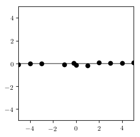

注意，对应于 y 坐标的随机选择仍然是随机的。将该单元运行几次以验证这一点。

我们将使用运行生成函数的约束执行的能力，通过运行模型生成函数的新执行来预测新坐标系下 y 坐标的值，其中对应于参数的随机选择被约束到它们推断值。我们提供了一个下面的函数（`predict_new_data`），它接受一个 trace 和一个新的 x 坐标向量，并返回一个对应于`new_xs`中 x 坐标的预测 y 坐标向量。我们设计了这个函数来处理多个模型，所以参数地址集是一个参数（`param_addrs`）：

```julia
function predict_new_data（model，trace，new_xs :: Vector {Float64}，param_addrs）

＃从推断的trace中复制参数值（`trace`）
＃成为一组新的约束。
constraints = Gen.choicemap（）
对于param_addrs中的addr
约束[addr] = trace [addr]
end

＃使用新的x坐标和参数运行模型
＃固定为推断值
（new_trace，_）= Gen.generate（model，（new_xs，），constraints）

＃拉出y值并返回它们
ys = [new_trace [（：y，i）] for i = 1：length（new_xs）]
返回ys
end;
```

下面的单元定义了一个函数，它首先对观察到的数据集`（xs，ys）`进行推理，然后运行`predict_new_data`来生成预测的 y 坐标。它重复这个过程`num_traces`次，并返回得到的 y 坐标向量的向量。

```julia
函数infer_and_predict（model，xs，ys，new_xs，param_addrs，num_traces，amount_of_computation）
pred_ys = []
对于i = 1：num_traces
trace = do_inference（model，xs，ys，amount_of_computation）
推！（pred_ys，predict_new_data（model，trace，new_xs，param_addrs））
end
pred_ys
end;
```

最后，我们定义一个单元格，将观察到的数据集“（xs，ys）”绘制为红点，将预测数据绘制为小黑点。

```julia
function plot_predictions（xs，ys，new_xs，pred_ys）
散射（xs，ys，color =“red”）
对于pred_ys中的pred_ys_single
scatter（new_xs，pred_ys_single，color =“black”，s = 1，alpha = 0.3）
end
end;
```

回想一下线模型的原始数据集。x 坐标跨越-5 到 5 的间隔。

```julia
图（figsize =（3,3））
scatter（xs，ys，color =“red”）;
```

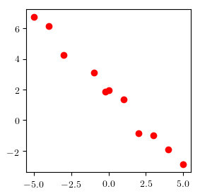

我们将使用参数的推断值来预测未观察到数据的区间 5 到 10 中的 x 坐标的 y 坐标。我们还将在-5 到 5 的区间内预测新数据，并将这些数据与原始观测数据进行比较。从推断参数预测新数据，并将这些新数据与观测数据进行比较是*后验预测检查*背后的核心思想。本教程并不打算对检查模型质量的技术进行严格的概述，而是打算给出高层次的直觉。

```julia
new_xs = collect(range(-5, stop=10, length=100));
```

我们生成并绘制预测数据：

```julia
pred_ys = infer_and_predict（line_model，xs，ys，new_xs，[：slope，：intercept]，20,1000）
图（figsize =（3,3））
plot_predictions（xs，ys，new_xs，pred_ys）
```

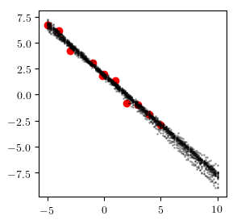

结果看起来合理，无论是在观察数据的区间内还是在右侧的外推预测中。

现在考虑使用以下数据集运行相同的实验，其具有明显更多的噪声。

```julia
ys_noisy = [5.092,4.781,2.46815,1.23047,0.903318,1.11819,2.10808,1.09198,0.0203789，-2.05068,2.66031];
```

```julia
pred_ys = infer_and_predict（line_model，xs，ys_noisy，new_xs，[：slope，：intercept]，20,1000）
图（figsize =（3,3））
plot_predictions（xs，ys_noisy，new_xs，pred_ys）
```

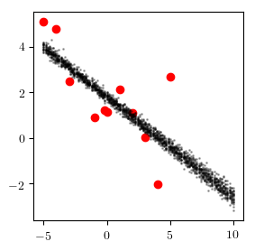

看起来生成的数据比观察到数据的情况下的观察数据噪声更小，并且看起来预测的数据过于自信。这表明我们的模型是错误指定的。在我们的例子中，这是因为我们假设噪音的值为 0.1。但是，数据中的实际噪声似乎要大得多。我们可以通过使噪声随机选择并将其值与其他参数一起推断来纠正这一点。

我们首先编写一个新版本的线模型，它从一个'gamma（1,1）`先验分布中随机选择噪声。

```julia
@gen function line_model_2（xs :: Vector {Float64}）
n =长度（xs）
slope = @trace（normal（0,1），：slope）
intercept = @trace（normal（0,2），：intercept）
noise = @trace（gamma（1,1）,: noise）
for（i，x）in enumerate（xs）
@trace（正常（斜率* x +截距，噪音），（：y，i））
end
没有回报
end;
```

然后，我们在`ys`数据集上使用推断未修改和修改的模型来比较预测：

```julia
figure(figsize=(6,3))

pred_ys = infer_and_predict（line_model，xs，ys，new_xs，[：slope，：intercept]，20,1000）
子图（1,2,1）
标题（“固定噪音水平”）
plot_predictions（xs，ys，new_xs，pred_ys）

pred_ys = infer_and_predict（line_model_2，xs，ys，new_xs，[：slope，：intercept，：noise]，20,10000）
子图（1,2,2）
标题（“推断的噪音水平”）
plot_predictions（xs，ys，new_xs，pred_ys）
```

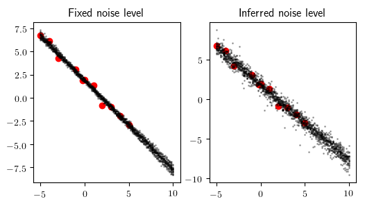

请注意，使用修改后的模型进行的预测存在更多不确定性。

我们还在`ys_noisy`数据集上使用推断未修改和修改的模型来比较预测：

```julia
图（figsize =（6,3））

pred_ys = infer_and_predict（line_model，xs，ys_noisy，new_xs，[：slope，：intercept]，20,1000）
子图（1,2,1）
标题（“固定噪音水平”）
plot_predictions（xs，ys_noisy，new_xs，pred_ys）

pred_ys = infer_and_predict（line_model_2，xs，ys_noisy，new_xs，[：slope，：intercept，：noise]，20,10000）
子图（1,2,2）
标题（“推断的噪音水平”）
plot_predictions（xs，ys_noisy，new_xs，pred_ys）
```

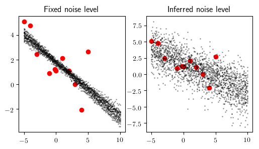

请注意，虽然未修改的模型非常过于自信，但修改后的模型具有适当的不确定性，同时仍然捕获一般的负面趋势。

---

### 练习

写一个修改版本的正弦模型，使噪声成为随机选择。将预测数据与未修改和修改模型的观察数据“infer_and_predict”和“plot_predictions”以及“ys_sine”和“ys_noisy”数据集进行比较。讨论结果。尝试使用的推理计算量。对于具有噪声随机选择的模型，推理计算量需要更高。

### 答案

```julia
@gen function sine_model_2（xs :: Vector {Float64}）
n =长度（xs）
phase = @trace（uniform（0,2 * pi），：phase）
period = @trace（gamma（5,1），：period）
amplitude = @trace（gamma（1,1），：幅度）
noise = @trace（gamma（1,1）,: noise）
for（i，x）in enumerate（xs）
mu =幅度* sin（2 * pi * x /周期+相位）
@trace（正常（mu，noise），（：y，i））
end
返回
end;
```

```julia
图（figsize =（6,3））

pred_ys = infer_and_predict（sine_model，xs，ys_sine，new_xs，[：phase，：period，：amplitude]，20,100）

子图（1,2,1）
标题（“固定噪音水平”）
plot_predictions（xs，ys_sine，new_xs，pred_ys）

pred_ys = infer_and_predict（sine_model_2，xs，ys_sine，new_xs，[：phase，：period，：amplitude，：noise]，20,1000）

子图（1,2,2）
标题（“推断的噪音水平”）
plot_predictions（xs，ys_sine，new_xs，pred_ys）
```

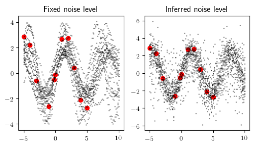

```julia
图（figsize =（6,3））

pred_ys = infer_and_predict（sine_model，xs，ys_noisy，new_xs，[：phase，：period，：amplitude]，20,100）

子图（1,2,1）
标题（“固定噪音水平”）
plot_predictions（xs，ys_noisy，new_xs，pred_ys）

pred_ys = infer_and_predict（sine_model_2，xs，ys_noisy，new_xs，[：phase，：period，：amplitude，：noise]，20,1000）

子图（1,2,2）
标题（“推断的噪音水平”）
plot_predictions（xs，ys_noisy，new_xs，pred_ys）
```

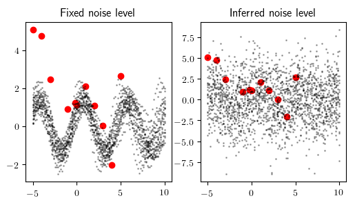

具有噪声推断的模型更能够避免对违反模型假设的数据集（`ys_noisy`）进行不准确的过度自信预测。

## 5。调用其他生成函数<a name="calling-functions"> </a>

除了随机选择外，生成函数还可以调用其他生成函数。为了说明这一点，我们将编写一个结合线模型和正弦模型的概率模型。该模型能够使用任一模型解释数据，并且选择哪个模型将取决于数据。这称为*模型选择*。

生成函数可以通过三种方式调用另一种生成函数：

- 使用常规的 Julia 函数调用语法

- 使用带有地址的`@ trace` Gen 关键字：`@trace（<call>，<addr>）`

- 使用没有地址的`@ trace` Gen 关键字：`@trace（<call>）`

当使用常规函数调用语法调用时，不 trace 被调用函数所做的随机选择。当使用没有地址的`@trace`进行调用时，被调用函数的随机选择与调用者的随机选择放在相同的地址命名空间中。当使用`@trace（<call>，<addr>）`时，被调用者的随机选择放在命名空间`<addr>`下。

```julia
@gen function foo（）
@trace（normal（0,1），：y）
end

@gen功能栏（）
@trace（bernoulli（0.5），：x）
@trace（FOO（））
end

@gen function bar_using_namespace（）
@trace（bernoulli（0.5），：x）
@trace（foo（），：z）
end;
```

我们首先显示`bar`采样的地址：

```julia
trace = Gen.simulate(bar, ())
println(Gen.get_choices(trace))
```

│
├──：y：-0.1555163501029882
│
└──：x：假

以及`bar_using_namespace`采样的地址：

```julia
trace = Gen.simulate(bar_using_namespace, ())
println(Gen.get_choices(trace))
```

│
├──：x：假
│
└──：z
│
└──：y：-0.3173884162416476

将`@ trace`与命名空间一起使用可以帮助避免复杂模型的地址冲突。

分层地址表示为 Julia`At pair`，其中该对的第一个元素是地址的第一个元素，该对的第二个元素是地址的其余部分：

```julia
trace[Pair(:z, :y)]
```

    -0.3173884162416476

Julia 使用`=>`运算符作为`Pair`构造函数的简写，因此我们可以访问分层地址的选项，如：

```julia
trace[:z => :y]
```

    -0.3173884162416476

如果我们有一个包含两个以上元素的分层地址，我们可以通过链接`=>`运算符来构造地址：

```julia
@gen function baz()
    @trace(bar_using_namespace(), :a)
end

trace = simulate(baz, ())

trace[:a => :z => :y]
```

    1.2035666821158528

注意`=>`运算符关联权限，所以这相当于：

```julia
trace[Pair(:a, Pair(:z, :y))]
```

    1.2035666821158528

现在，我们编写了一个生成函数，它结合了线和正弦模型。它使伯努利随机选择（例如，返回真或假的硬币翻转），确定两个模型中的哪一个将生成数据。

```julia
@gen function combined_model（xs :: Vector {Float64}）
if @trace（bernoulli（0.5），：is_line）
@trace（line_model_2（XS））
其他
@trace（sine_model_2（XS））
end
end;
```

我们还为这个函数的 trace 编写了一个可视化：

```julia
function render_combined（trace; show_data = true）
如果trace[：is_line]
render_trace（trace，show_data = show_data）
其他
render_sine_trace（trace，show_data = show_data）
end
end;
```

我们可以看到一些痕迹，并且有时会看到线性数据和其他时间的正弦数据。

```julia
traces = [Gen.simulate（combined_model，（xs，））for = = 1：12];
网格（render_combined，trace）
```

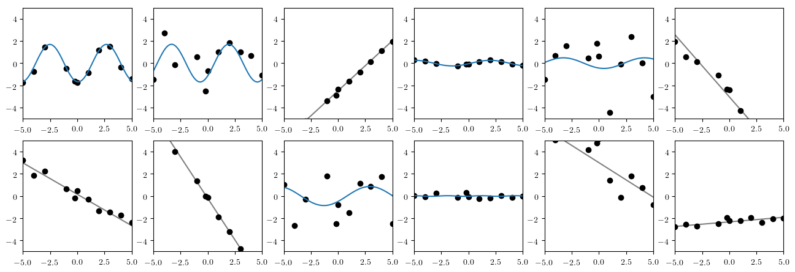

我们在`ys`数据集和`ys_sine`数据集上使用这个组合模型进行推理。

```julia
图（figsize =（6,3））
子图（1,2,1）
trace = [do_inference（combined_model，xs，ys，10000）for _ = 1:10];
overlay（render_combined，traces）
子图（1,2,2）
trace = [do_inference（combined_model，xs，ys_sine，10000）for _ = 1:10];
overlay（render_combined，traces）
```

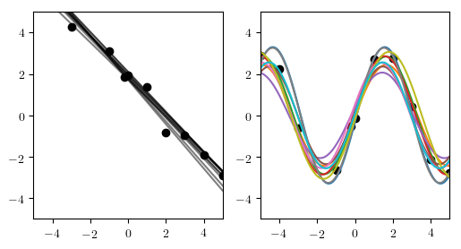

结果应该表明，为'ys`数据集推断了线模型，并推断了`ys_sine`数据集的正弦波模型。

---

### 练习

构造一个数据集，对于该数据集，线或正弦波模型是否最佳是不明确的。使用`render_combined`可视化推断的轨迹以说明模糊性。编写一个程序，该程序获取数据集并返回由正弦波模型生成数据的后验概率的估计值，并在您的数据集上运行它。

提示：要估计正弦波模型生成数据的后验概率，多次运行推理程序以计算大量迹线，然后计算“：is_line”为假的那些迹线的分数。

---

### 练习

在`line_model_2`和`sine_model_2`之间存在重复的代码。重构模型以减少代码重复并提高代码的可读性。重新运行上面的实验并确认结果在质量上是相同的。您可能需要编写新的渲染功能。尽量避免在模型和渲染代码之间引入代码重复。

提示：为避免在模型和渲染代码之间引入代码重复，请使用生成函数的返回值。

```julia
@gen function line_model_refactored（）
＃<您的代码在这里>
end;
```

```julia
@gen函数sine_model_refactored（）
＃<您的代码在这里>
end;
```

```julia
@gen function combined_model_refactored（xs :: Vector {Float64}）
＃<您的代码在这里>
end;
```

```julia
function render_combined_refactored（trace; show_data = true）
xs = Gen.get_args（trace）[1]
xmin =最小值（xs）
xmax =最大值（xs）
如果是show_data
ys = [trace [（：y，i）] for i = 1：length（xs）]
散射（xs，ys，c =“黑色”）
end

＃<您的代码在这里>

ax = gca（）
ax [：set_xlim]（（xmin，xmax））
ax [：set_ylim]（（xmin，xmax））
end;

```

```julia
图（figsize =（6,3））
子图（1,2,1）
trace = [do_inference（combined_model_refactored，xs，ys，10000）for _ = 1:10];
overlay（render_combined_refactored，traces）
子图（1,2,2）
trace = [do_inference（combined_model_refactored，xs，ys_sine，10000）for _ = 1:10];
overlay（render_combined_refactored，traces）
```

## 6。使用无限数量的参数进行建模<a name="infinite-space"> </a>

Gen 的内置建模语言可用于表达使用无限数量参数的模型。本节将引导您完成数据模型的开发，该模型不是先验地指定模型复杂性的上限，而是推断模型的复杂性以及参数。这是*贝叶斯非参数*模型的简单示例。

我们将考虑两个数据集：

```julia
xs_dense = collect（范围（-5，停止= 5，长度= 50））
ys_simple = fill（1。，length（xs_dense））。+ randn（length（xs_dense））* 0.1
ys_complex = [Int（floor（abs（x / 3）））％2 == 0？2：0表示xs_dense中的x。+ randn（长度（xs_dense））* 0.1;
```

```julia
图（figsize =（6,3））

子图（1,2,1）
标题（ “YS-简单”）
scatter（xs_dense，ys_simple，color =“black”，s = 10）
gca（）[：set_ylim]（（ -  1,3））

子图（1,2,2）
标题（ “YS-复合物”）
scatter（xs_dense，ys_complex，color =“black”，s = 10）
gca（）[：set_ylim]（（ -  1,3））
```

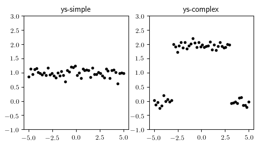

（-1,3）

左侧的数据似乎最好解释为具有一些噪音的连续函数。右侧的数据集似乎包含两个变更点，变更点之间具有常量函数。我们想要一个不先验地选择数据中变更点数量的模型。为此，我们将递归地将间隔划分为区域。我们定义了一个表示间隔二叉树的 Julia 数据结构;每个叶节点表示函数恒定的区域。

```julia
struct Interval
升:: Float64
ü:: Float64
end
```

```julia
抽象类型节点end

struct InternalNode <：Node
左::节点
右::节点
区间::区间
end

struct LeafNode <：Node
值:: Float64
区间::区间
end
```

我们现在编写一个随机创建这样一棵树的生成函数。注意在此函数中使用递归来创建表示任意多个变化点的任意大树。另请注意，我们将地址命名空间`：left`和`：right`分配给对“generate_segments”的两次递归调用的调用。

```julia
@gen function generate_segments（l :: Float64，u :: Float64）
interval = Interval（l，u）
if @trace（bernoulli（0.7），：isleaf）
value = @trace（normal（0,1），：value）
return LeafNode（value，interval）
其他
frac = @trace（beta（2,2），：frac）
mid = l +（u  -  l）* frac
left = @trace（generate_segments（l，mid），：left）
right = @trace（generate_segments（mid，u），：right）
return InternalNode（left，right，interval）
end
end;
```

我们还定义了一些辅助函数来可视化`generate_segments`函数的痕迹。

```julia
function render_node（node :: LeafNode）
plot（[node.interval.l，node.interval.u]，[node.value，node.value]）
end

function render_node（node :: InternalNode）
render_node（node.left）
render_node（node.right）
end;
```

```julia
函数render_segments_trace（trace）
node = get_retval（trace）
render_node（节点）
ax = gca（）
ax [：set_xlim]（（0,1））
ax [：set_ylim]（（ -  3,3））
end;
```

我们从这个函数生成 12 个 trace，并在下面显示它们。我们绘制了每次运行生成函数所采样的分段常数函数。不同的常数段以不同的颜色显示。运行单元格几次，以更好地了解由生成函数表示的函数的分布。

```julia
trace = [Gen.simulate（generate_segments，（0，））for i = 1:12]
网格（render_segments_trace，trace）
```

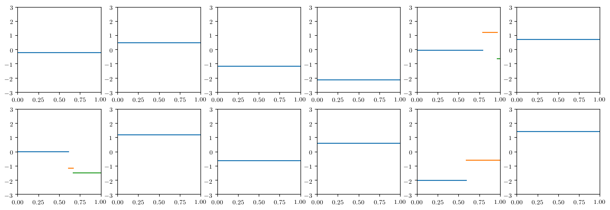

因为我们只对 30％概率的区间进行细分，所以这些采样迹线中的大部分只有一个区段。

现在我们已经生成了一个生成随机分段常数函数的生成函数，我们编写了一个模型，它将噪声添加到生成的常量函数中，以生成 y 坐标的数据集。噪音水平将是随机选择。

```julia
#get_value_at在二叉树中搜索
＃包含一些值的叶节点。
function get_value_at（x :: Float64，node :: LeafNode）
@assert x> = node.interval.l && x <= node.interval.u
return node.value
end

function get_value_at（x :: Float64，node :: InternalNode）
@assert x> = node.interval.l && x <= node.interval.u
如果x <= node.left.interval.u
get_value_at（x，node.left）
其他
get_value_at（x，node.right）
end
end

＃完整模型
@gen function changepoint_model（xs :: Vector {Float64}）
node = @trace（generate_segments（minimum（xs），maximum（xs）），：tree）
noise = @trace（gamma（1,1）,: noise）
for（i，x）in enumerate（xs）
@trace（normal（get_value_at（x，node），noise），（：y，i））
end
返回节点
end;
```

我们在下面为`changepoint_model`编写一个可视化：

```julia
function render_changepoint_model_trace（trace; show_data = true）
xs = Gen.get_args（trace）[1]
node = Gen.get_retval（trace）
render_node（节点）
如果是show_data
ys = [trace [（：y，i）] for i = 1：length（xs）]
散射（xs，ys，c =“黑色”）
end
ax = gca（）
ax [：set_xlim]（（minimum（xs），maximum（xs）））
ax [：set_ylim]（（ -  3,3））
end;
```

最后，我们生成一些模拟数据集，并在生成它们的基础分段常量函数之上将它们可视化：

```julia
trace = [Gen.simulate（changepoint_model，（xs_dense，））for i = 1:12]
grid（render_changepoint_model_trace，traces）
```

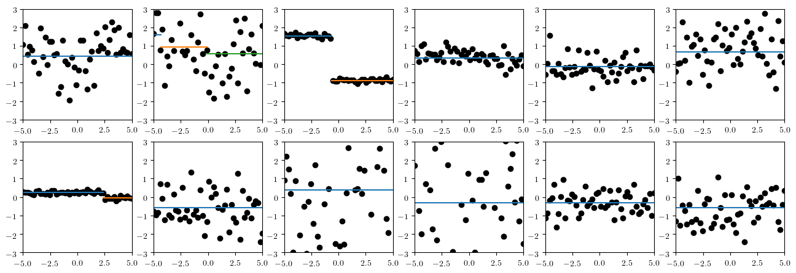

请注意，分段常量平均函数周围的可变量因 trace 而异。

现在我们对简单数据集进行推理：

```julia
trace = [do_inference（changepoint_model，xs_dense，ys_simple，10000）for _ = 1：12];
grid（render_changepoint_model_trace，traces）
```

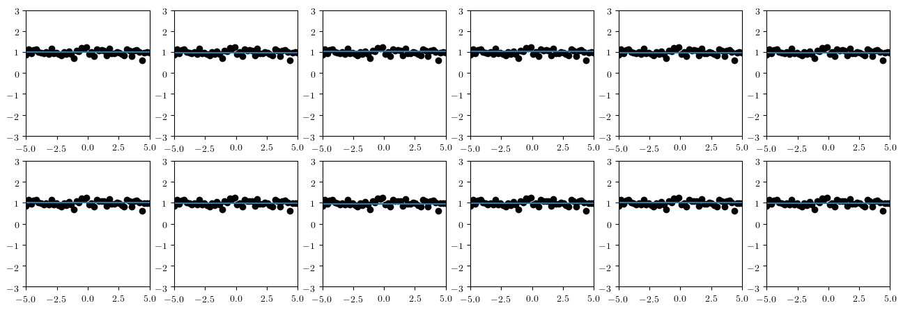

我们看到，我们推断出解释数据的平均函数是一个非常高概率的常数。

对于复杂数据集的推断，我们使用更多的计算。您可以尝试不同的计算量，以查看推理质量如何随着计算量的减少而降低。请注意，我们在本教程中使用了一个非常简单的通用推理算法，它实际上不适合这个更复杂的任务。在后面的教程中，我们将学习如何编写更有效的算法，以便在计算量大大减少的情况下获得准确的结果。无论推理算法如何，我们还将看到注释模型以获得更好性能的方法。

```julia
trace = [do_inference（changepoint_model，xs_dense，ys_complex，100000）for _ = 1：12];
grid（render_changepoint_model_trace，traces）
```

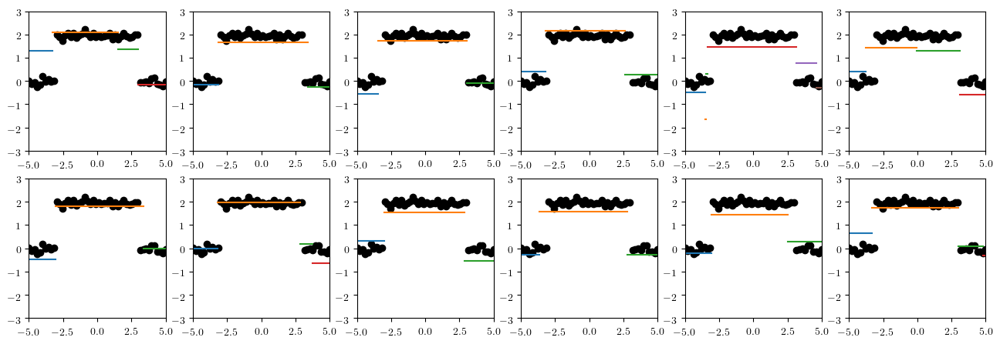

结果表明，对于更复杂的数据集，推断出更多的段。

---

### 练习

编写一个函数，该函数采用 x 和 y 坐标的数据集，并绘制关于变化点数量的概率分布的直方图。
显示`ys_simple`和`ys_complex`数据集的结果。

提示：`changepoint_model`的返回值是`Node`值的树。走这棵树。

---

### 练习

编写一个新版本的`changepoint_model`，它使用没有地址的`@trace`（例如`@trace（<call>）`）来进行递归调用。

提示：您需要保证所有地址都是唯一的。如何使用整数标记二叉树中的每个节点？
