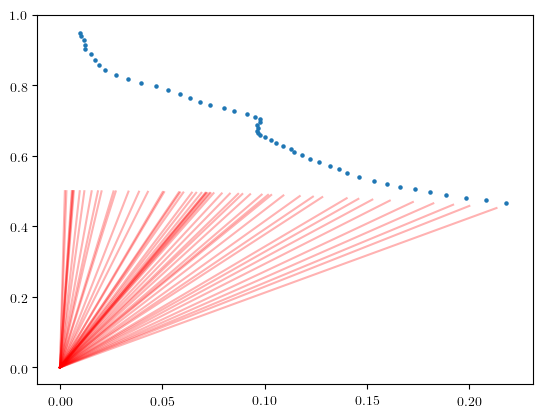
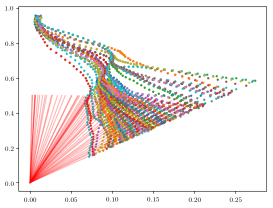
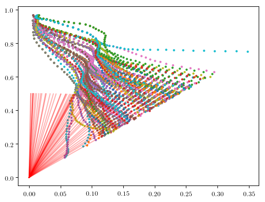
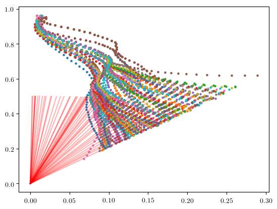
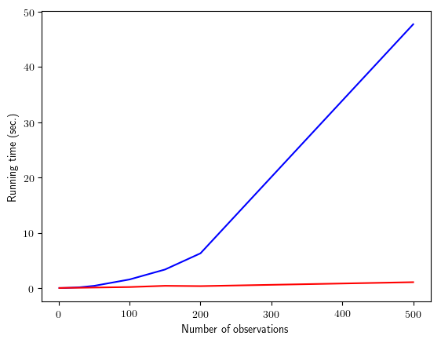

# 教程：Gen 中的粒子滤波

序列蒙特卡洛（SMC）方法（例如粒子滤波）使用基于重要性的采样的技术（在某些情况下为马尔可夫链蒙特卡洛 MCMC）来迭代式解决*一序列推理问题*。序列中各个问题的解表示为样本的集合，或者*粒子*。每个问题的粒子都基于序列中先前问题的粒子的扩展或调整。

如粒子过滤一样，解决的推理问题序列通常是由逐渐到达的观察结果自然产生的。如退火的重要性抽样[3]一样，也可以通过工具构建问题以促进推理。本教程介绍了如何使用 Gen 为使用“回春” MCMC 运动的跟踪问题实现粒子过滤器。具体来说，我们将解决[4]中描述的“仅轴承跟踪”问题。

[1] Doucet, Arnaud, Nando De Freitas, and Neil Gordon."An introduction to sequential Monte Carlo methods."Sequential Monte Carlo methods in practice.Springer, New York, NY, 2001.3-14.

[2] Del Moral, Pierre, Arnaud Doucet, and Ajay Jasra."Sequential monte carlo samplers."Journal of the Royal Statistical Society: Series B (Statistical Methodology) 68.3 (2006): 411-436.

[3] Neal, Radford M. "Annealed importance sampling."Statistics and computing 11.2 (2001): 125-139.

[4] Gilks, Walter R., and Carlo Berzuini."Following a moving target—Monte Carlo inference for dynamic Bayesian models."Journal of the Royal Statistical Society: Series B (Statistical Methodology) 63.1 (2001): 127-146.[PDF](http://www.mathcs.emory.edu/~whalen/Papers/BNs/MonteCarlo-DBNs.pdf)

## 大纲

**第 1 节**：[Implementing the generative model](#basic-model)

**第 2 节**：[Implementing a basic particle filter](#basic-pf)

**第 3 节**：[Adding rejuvenation moves](#rejuv)

**第 4 节**：[Using the unfold combinator to improve performance](#unfold)

```julia
using Gen
using PyPlot
```

## 1.实施生成模型 <a name="basic-model"></a>

我们将为点在 xy 平面中的移动实现一个生成模型，并随时间测量该点相对于原点的位置。

我们假设我们知道该点的近似初始位置和速度。我们假设该点的 x 和 y 速度会受到从一些具有已知方差的正态分布中得出的随机扰动的影响。每次方位测量均由相对于正 x 轴跟踪的点的角度组成。

我们在下面将生成模型写为生成函数。该函数首先从先验分布中采样点的初始状态，然后在“ for”循环中生成“ T”个连续状态。该模型的参数是不包括初始状态的状态数。

```julia
bearing(x, y) = atan(y, x)

@gen function model(T::Int)

    measurement_noise = 0.005
    velocity_var = (1.0/1e6)

    xs = Vector{Float64}(undef, T+1)
    ys = Vector{Float64}(undef, T+1)

    # prior on initial x-coordinate
    x = @trace(normal(0.01, 0.01), :x0)

    # prior on initial y-coordinate
    y = @trace(normal(0.95, 0.01), :y0)

    # prior on x-component of initial velocity
    vx = @trace(normal(0.002, 0.01), :vx0)

    # prior on y-component of initial velocity
    vy = @trace(normal(-0.013, 0.01), :vy0)

    # initial bearing measurement
    @trace(normal(bearing(x, y), measurement_noise), :z0)

    # record position
    xs[1] = x
    ys[1] = y

    # generate successive states and measurements
    for t=1:T

        # update the state of the point
        vx = @trace(normal(vx, sqrt(velocity_var)), (:vx, t))
        vy = @trace(normal(vy, sqrt(velocity_var)), (:vy, t))
        x += vx
        y += vy

        # bearing measurement
        @trace(normal(bearing(x, y), measurement_noise), (:z, t))

        # record position
        xs[t+1] = x
        ys[t+1] = y
    end

    # return the sequence of positions
    return (xs, ys)
end;
```

通过从该模型中以“ T = 50”进行采样，我们生成了一个位置数据集并观察了轴承：

```julia
import Random
Random.seed!(4)

# 生成具有特定初始条件的跟踪
T = 50
constraints = Gen.choicemap((:x0, 0.01), (:y0, 0.95), (:vx0, 0.002), (:vy0, -0.013))
(trace, _) = Gen.generate(model, (T,), constraints)

# extract the observed data (zs) from the trace
choices = Gen.get_choices(trace)
zs = Vector{Float64}(undef, T+1)
zs[1] = choices[:z0]
for t=1:T
    zs[t+1] = choices[(:z, t)]
end
```

接下来，我们在下面为该模型的痕迹编写可视化文件。它从原点开始以线的形式显示位置和点以及观察到的方位：

```julia
function render(trace; show_data=true, max_T=get_args(trace)[1])
    (T,) = Gen.get_args(trace)
    choices = Gen.get_choices(trace)
    (xs, ys) = Gen.get_retval(trace)
    zs = Vector{Float64}(undef, T+1)
    zs[1] = choices[:z0]
    for t=1:T
        zs[t+1] = choices[(:z, t)]
    end
    scatter(xs[1:max_T+1], ys[1:max_T+1], s=5)
    if show_data
        for z in zs[1:max_T+1]
            dx = cos(z) * 0.5
            dy = sin(z) * 0.5
            plot([0., dx], [0., dy], color="red", alpha=0.3)
        end
    end
end;
```

我们将以下合成迹线可视化：

```julia
render(trace)
```



## 2.实施基本的粒子过滤器<a name="basic-pf"></a>

在 Gen 中，“粒子”表示为迹线“ \*\*”，并且粒子过滤器状态包含迹线的加权集合。在下面，我们定义了一个推理程序，该程序在观察到的轴承数据集（zs）上运行粒子过滤器。我们在内部使用“ num_particles”粒子，然后从粒子过滤器生成的加权集合中返回“ num_samples”迹线的样本。

Gen 提供了用于初始化和更新粒子过滤器状态的方法，该方法记录在[Particle Filtering]（https://probcomp.github.io/Gen/dev/ref/inference/#Particle-Filtering-1）中。

- `Gen.initialize_particle_filter`

- `Gen.particle_filter_step!`

这两种方法都可以与默认投标或自定义投标一起使用。在本教程中，我们将使用默认建议。还有一种方法可以根据粒子的权重对其进行重新采样，该方法可以将粒子重新分配到潜在空间的较有希望的部分。

- `Gen.maybe_resample!`

Gen 还提供了一种从粒子过滤器状态下的当前加权集合中采样未加权迹线集合的方法：

- `Gen.sample_unweighted_traces`

```julia
函数particle_filter（num_particles :: Int，zs :: Vector {Float64}，num_samples :: Int）

    # construct initial observations
    init_obs = Gen.choicemap((:z0, zs[1]))
    state = Gen.initialize_particle_filter(model, (0,), init_obs, num_particles)

    # steps
    for t=1:length(zs)-1
        Gen.maybe_resample!(state, ess_threshold=num_particles/2)
        obs = Gen.choicemap(((:z, t), zs[t+1]))
        Gen.particle_filter_step!(state, (t,), (UnknownChange(),), obs)
    end

    # return a sample of unweighted traces from the weighted collection
    return Gen.sample_unweighted_traces(state, num_samples)
end;
```

The initial state is obtained by providing the following to `initialize_particle_filter`:

- The generative function for the generative model (`model`)

- The initial arguments to the generative function.

- The initial observations, expressed as a map from choice address to values (`init_obs`).

- The number of particles.

在每个步骤中，我们从跟踪的集合中重新采样（“ maybe_resample！”），然后通过在状态上调用“ particle_filter_step！”来引入另一种方位测量。We pass the following arguments to `particle_filter_step!`:

- The state (it will be mutated)

- The new arguments to the generative function for this step.In our case, this is the number of measurements beyond the first measurement.

- The [argdiff](https://probcomp.github.io/Gen/dev/ref/gfi/#Argdiffs-1) value, which provides detailed information about the change to the arguments between the previous step and this step.我们稍后将重新讨论该值。现在，我们表明我们不知道`T :: Int`参数将如何随着每个步骤而变化。

-与新步骤相关的新观察值。在我们的情况下，这仅包含最新的度量。

我们使用 5000 个粒子运行此粒子过滤器，并返回 100 个粒子的样本。这将需要 30-60 秒。在后面的部分中，我们将看到一种加快粒子过滤器速度的方法。

```julia
@time pf_traces = particle_filter(5000, zs, 200);
```

     36.481359 seconds (134.90 M allocations: 5.846 GiB, 47.35% gc time)

To render these traces, we first define a function that overlays many renderings:

```julia
function overlay(renderer, traces; same_data=true, args...)
    renderer(traces[1], show_data=true, args...)
    for i=2:length(traces)
        renderer(traces[i], show_data=!same_data, args...)
    end
end;
```

We then render the traces from the particle filter:

```julia
overlay(render, pf_traces, same_data=true)
```



请注意，在更密集的方位测量期间，轨迹趋于转向，因此航向更加平行于方位矢量。另一种解释是，该点保持恒定的航向，但速度大大降低。有趣的是，推论比“慢速解释”更倾向于“转向解释”。

---

### Exercise

Run the particle filter with fewer particles and visualize the results.

### Solution

---

## 3.增加回春动作<a name="rejuv"></a>

有时在步骤之间将 MCMC 移动添加到粒子过滤器中的粒子很有用。这些 MCMC 动作通常被称为“复兴动作” [4]。每个回春动作的目标是给定步骤的“当前后验分布”。例如，在合并 3 个观测值后应用回春动作时，给定前三个观测值，我们的回春动作将潜变量的条件分布作为其静态分布。

接下来，我们编写一个粒子过滤器的版本，对每个粒子应用两次随机行走的 Metropolis-Hastings 复兴运动。

下面的单元格定义了 Metropolis-Hastings 摄动运动，该摄动运动扰动了介于“ a”和“ b”之间的一个时间步长的速度矢量。

```julia
@gen function perturbation_proposal(prev_trace, a::Int, b::Int)
    choices = get_choices(prev_trace)
    (T,) = get_args(prev_trace)
    for t=a:b
        vx = @trace(normal(choices[(:vx, t)], 1e-3), (:vx, t))
        vy = @trace(normal(choices[(:vy, t)], 1e-3), (:vy, t))
    end
end

function perturbation_move(trace, a::Int, b::Int)
    Gen.metropolis_hastings(trace, perturbation_proposal, (a, b))
end;
```

我们将其添加到下面的粒子过滤推理程序中。我们应用回春动作来调整前 5 个时间步的速度。

```julia
function particle_filter_rejuv(num_particles::Int, zs::Vector{Float64}, num_samples::Int)
    init_obs = Gen.choicemap((:z0, zs[1]))
    state = Gen.initialize_particle_filter(model, (0,), init_obs, num_particles)
    for t=1:length(zs)-1

        # 对每个粒子应用复兴运动
        for i=1:num_particles
            state.traces[i], _ = perturbation_move(state.traces[i], max(1, t-5), t-1)
        end

        Gen.maybe_resample!(state, ess_threshold=num_particles/2)
        obs = Gen.choicemap(((:z, t), zs[t+1]))
        Gen.particle_filter_step!(state, (t,), (UnknownChange(),), obs)
    end

    # 从加权集合中返回未加权迹线的样本
    返回Gen.sample_unweighted_traces（state，num_samples）
end;
```

我们在下面运行具有活力的粒子过滤器。这将需要一两分钟。We will see one way of speeding up the particle filter in a later section.

```julia
@time pf_rejuv_traces = particle_filter_rejuv(5000, zs, 200);
```

     72.251390 seconds (334.61 M allocations: 14.156 GiB, 34.14% gc time)

We render the traces:

```julia
overlay(render, pf_rejuv_traces, same_data=true)
```



## 4.使用展开组合器提高性能<a name="unfold"></a>

对于上述粒子滤波算法，在更新步骤中，仅需重新访问最近的状态（如果使用了回春运动，则需要重新访问最近的 5 个状态），因为初始状态永远不会更新，并且这些状态对权重计算取消。

但是，粒子过滤器推理程序的每个更新步骤在跟踪的大小上“线性”缩放，因为它在计算权重更新时会访问每个状态。这是因为默认情况下，内置建模 DSL 总是在执行跟踪更新时始终执行生成功能主体的端到端执行。这使得内置的建模 DSL 可以非常灵活并具有简单的实现，但会降低性能。在内置建模 DSL 中编写了原型后，有几种提高性能的方法。其中之一是[Generative Function Combinators]（https://probcomp.github.io/Gen/dev/ref/combinators/），它使生成过程中的信息流对Gen更为明显，并且使渐近效率更高推理程序。

为了利用增量计算的机会并改善粒子滤波器推理程序的缩放行为，我们将编写一个新模型，该模型使用生成函数组合器替换模型中的以下 Julia`for`循环。

```julia
    # generate successive states and measurements
    for t=1:T

        # 更新点的状态
        vx = @trace(normal(vx, sqrt(velocity_var)), (:vx, t))
        vy = @trace(normal(vy, sqrt(velocity_var)), (:vy, t))
        x += vx
        y += vy

        # 承受度测量
        @trace(normal(bearing(x, y), measurement_noise), (:z, t))

        # 记录位置
        xs[t+1] = x
        ys[t+1] = y
    end
```

这个“ for”循环具有非常特定的信息流模式-有一系列状态（用“ x，y，vx 和 vy 表示”），每个状态都是从前一个状态生成的。这正是[Unfold]（https://probcomp.github.io/Gen/dev/ref/combinators/#Unfold-combinator-1）生成函数组合器设计的模式。

下面，我们使用 Unfold 组合器在状态序列上重新表达 Julia 循环。具体来说，我们定义一个生成函数（内核），该函数将先前状态作为第二个参数，并返回新状态。Unfold 组合器获取内核并返回一个新的生成函数（链），该函数反复应用内核。请阅读“展开组合器”文档，以详细了解生成的生成功能（链）的行为。

```julia
struct State
    x::Float64
    y::Float64
    vx::Float64
    vy::Float64
end

@gen (static) function kernel(t::Int, prev_state::State,
                              velocity_var::Float64, measurement_noise::Float64)
    vx = @trace(normal(prev_state.vx, sqrt(velocity_var)), :vx)
    vy = @trace(normal(prev_state.vy, sqrt(velocity_var)), :vy)
    x = prev_state.x + vx
    y = prev_state.y + vy
    @trace(normal(bearing(x, y), measurement_noise), :z)
    next_state = State(x, y, vx, vy)
    return next_state
end

chain = Gen.Unfold(kernel)

Gen.load_generated_functions()
```

我们可以通过跟踪和打印随机选择来了解链的行为：

```julia
trace = Gen.simulate(chain, (4, State(0., 0., 0., 0.), 0.01, 0.01))
println(Gen.get_choices(trace))
```

    │
    ├── 1
    │   │
    │   ├── :vx : -0.08970902180131173
    │   │
    │   ├── :vy : -0.10682294942385842
    │   │
    │   └── :z : -2.2912702846132453
    │
    ├── 2
    │   │
    │   ├── :vx : -0.1941244343164683
    │   │
    │   ├── :vy : -0.18185481061346262
    │   │
    │   └── :z : -2.340595555861278
    │
    ├── 3
    │   │
    │   ├── :vx : -0.24238833226466439
    │   │
    │   ├── :vy : -0.07267414148918251
    │   │
    │   └── :z : -2.5432083216947494
    │
    └── 4
        │
        ├── :vx : -0.3639453051064175
        │
        ├── :vy : -0.1455945832678338
        │
        └── :z : -2.6233328025606513

现在，我们编写一个生成模型的新版本，该模型将调用 chain 而不是使用 Julia for 循环：

```julia
@gen (static) function unfold_model(T::Int)

    # 参数
    measurement_noise = 0.005
    velocity_var = 1e-6

    # 初始状态
    x = @trace(normal(0.01, 0.01), :x0)
    y = @trace(normal(0.95, 0.01), :y0)
    vx = @trace(normal(0.002, 0.01), :vx0)
    vy = @trace(normal(-0.013, 0.01), :vy0)

    # 初始测量
    z = @trace(normal(bearing(x, y), measurement_noise), :z0)

    # record initial state
    init_state = State(x, y, vx, vy)

    # 命名空间`:hain`下运行`chain`函数，产生状态向量
    states = @trace(chain(T, init_state, velocity_var, measurement_noise), :chain)

    result = (init_state, states)
    return result
end;

Gen.load_generated_functions()
```

让我们生成此新模型程序的痕迹，以了解其结构：

```julia
(trace, _) = Gen.generate(unfold_model, (4,))
println(Gen.get_choices(trace))
```

    │
    ├── :x0 : 0.01046259889720223
    │
    ├── :y0 : 0.9480796760211051
    │
    ├── :vx0 : -0.016146187712751288
    │
    ├── :vy0 : -0.021877921008695483
    │
    ├── :z0 : 1.5658875595556638
    │
    └── :chain
        │
        ├── 1
        │   │
        │   ├── :vx : -0.015994703197911624
        │   │
        │   ├── :vy : -0.02199988311438922
        │   │
        │   └── :z : 1.5758174767535693
        │
        ├── 2
        │   │
        │   ├── :vx : -0.017592576483682166
        │   │
        │   ├── :vy : -0.021833363037200983
        │   │
        │   └── :z : 1.601880885130888
        │
        ├── 3
        │   │
        │   ├── :vx : -0.017105404183538057
        │   │
        │   ├── :vy : -0.02134346447535751
        │   │
        │   └── :z : 1.6156207105482778
        │
        └── 4
            │
            ├── :vx : -0.02033475521260161
            │
            ├── :vy : -0.02030158417422561
            │
            └── :z : 1.640019788042328

```julia
function unfold_particle_filter(num_particles::Int, zs::Vector{Float64}, num_samples::Int)
    init_obs = Gen.choicemap((:z0, zs[1]))
    state = Gen.initialize_particle_filter(unfold_model, (0,), init_obs, num_particles)
    for t=1:length(zs)-1

        maybe_resample!(state, ess_threshold=num_particles/2)
        obs = Gen.choicemap((:chain => t => :z, zs[t+1]))
        Gen.particle_filter_step!(state, (t,), (UnknownChange(),), obs)
    end

    # 权集合中返回痕量样本：
    return Gen.sample_unweighted_traces(state, num_samples)
end;
```

```julia
@time unfold_pf_traces = unfold_particle_filter(5000, zs, 200);
```

      7.869715 seconds (29.99 M allocations: 1.622 GiB, 20.89% gc time)

```julia
function unfold_render(trace; show_data=true, max_T=get_args(trace)[1])
    (T,) = Gen.get_args(trace)
    choices = Gen.get_choices(trace)
    (init_state, states) = Gen.get_retval(trace)
    xs = Vector{Float64}(undef, T+1)
    ys = Vector{Float64}(undef, T+1)
    zs = Vector{Float64}(undef, T+1)
    xs[1] = init_state.x
    ys[1] = init_state.y
    zs[1] = choices[:z0]
    for t=1:T
        xs[t+1] = states[t].x
        ys[t+1] = states[t].y
        zs[t+1] = choices[:chain => t => :z]
    end
    scatter(xs[1:max_T+1], ys[1:max_T+1], s=5)
    if show_data
        for z in zs[1:max_T+1]
            dx = cos(z) * 0.5
            dy = sin(z) * 0.5
            plot([0., dx], [0., dy], color="red", alpha=0.3)
        end
    end
end;
```

让我们检查结果是否合理：

```julia
overlay(unfold_render, unfold_pf_traces, same_data=true)
```



现在，我们凭经验研究（1）使用 Julia'for`循环的推理程序和（2）使用 Unfold 的等效推理程序的缩放行为。我们将使用伪造的 z 数据长向量，并研究运行时间如何取决于观测值的数量。

```julia
fake_zs = rand(1000);

function timing_experiment(num_observations_list::Vector{Int}, num_particles::Int, num_samples::Int)
    times = Vector{Float64}()
    times_unfold = Vector{Float64}()
    for num_observations in num_observations_list
        println("evaluating inference programs for num_observations: $num_observations")
        tstart = time_ns()
        traces = particle_filter(num_particles, fake_zs[1:num_observations], num_samples)
        push!(times, (time_ns() - tstart) / 1e9)

        tstart = time_ns()
        traces = unfold_particle_filter(num_particles, fake_zs[1:num_observations], num_samples)
        push!(times_unfold, (time_ns() - tstart) / 1e9)

    end
    (times, times_unfold)
end;

num_observations_list = [1, 3, 10, 30, 50, 100, 150, 200, 500]
(times, times_unfold) = timing_experiment(num_observations_list, 100, 20);
```

    evaluating inference programs for num_observations: 1
    evaluating inference programs for num_observations: 3
    evaluating inference programs for num_observations: 10
    evaluating inference programs for num_observations: 30
    evaluating inference programs for num_observations: 50
    evaluating inference programs for num_observations: 100
    evaluating inference programs for num_observations: 150
    evaluating inference programs for num_observations: 200
    evaluating inference programs for num_observations: 500

请注意，没有展开的推理程序的运行时间在观察数量上似乎是平方的，而使用展开的推理程序的运行时间似乎呈线性比例：

```julia
plot(num_observations_list, times, color="blue")
plot(num_observations_list, times_unfold, color="red")
xlabel("Number of observations")
ylabel("Running time (sec.)");
```


